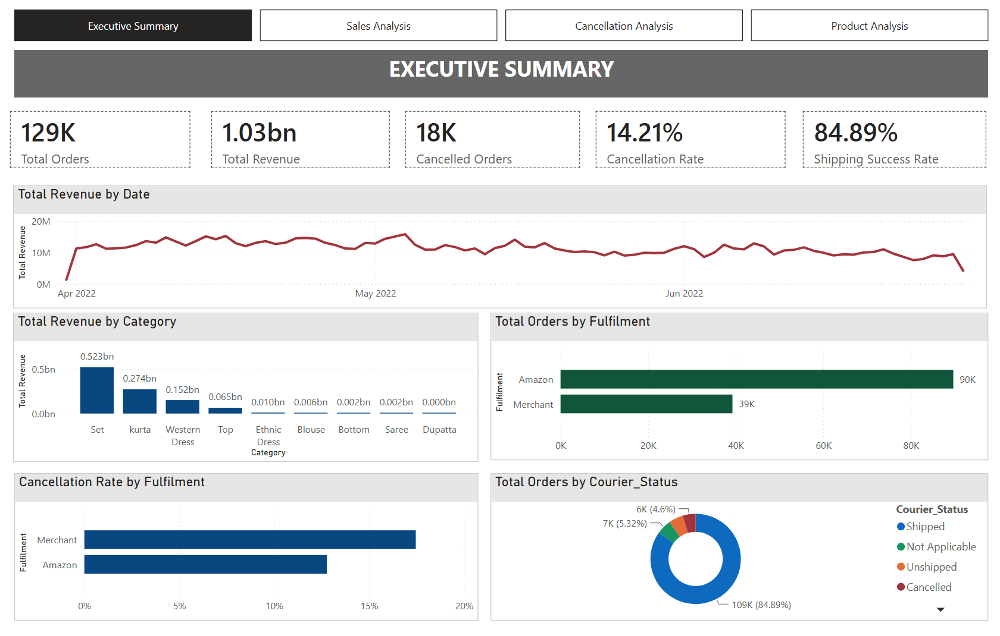
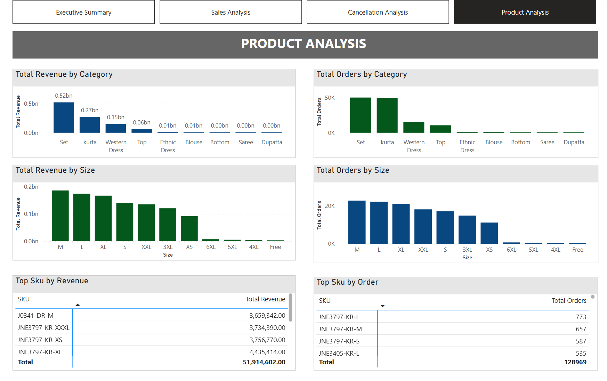
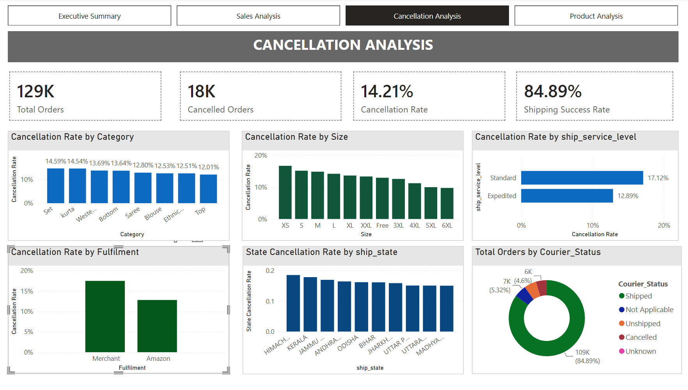

# AMAZON SALES ANALYTICS 
## Project Overview 
This project showcases an interactive Amazon Sales Analytics Dashboard built using SQL and Power BI. The report provides end-to-end insights into sales performance, product demand, fulfilment operations, cancellation behaviour, shipping performance, and geographic distribution.

The project covers the analytics lifecycle from raw data preparation and SQL-based data cleaning to exploratory analysis, KPI development, interactive dashboard design, and business recommendations.

The analysis is based on 128,969 cleaned Amazon sales transactions covering the period from 31 March 2022 to 29 June 2022.

## Business Context

Amazon sales operations involve multiple dimensions of performance, including product demand, fulfilment method, shipping status, cancellations, and geographic distribution. 

This project focuses on understanding:
* Which products and categories drive revenue?
* How does sales performance change over time?
* Does Amazon or Merchant fulfilment perform better?
* Where are cancellations concentrated?
* What proportion of orders successfully progress through shipping?
* Which geographic markets generate the most demand?
* How important are B2B and B2C customer segments?
* Where are the main opportunities for operational improvement?

The analysis uses SQL as the analytical layer and Power BI as the reporting and visualisation layer.

## What this project demonstrates
| Skill Area | Details |
|---|---|
| **Data Cleaning** | Missing-value investigation, duplicate detection, status standardisation, data validation |
| **SQL Analysis** | Aggregations, CTEs, CASE statements, window functions, ranking and business analysis |
| **Exploratory Data Analysis** | Sales, product, fulfilment, cancellation and geographic analysis |
| **KPI Development** | Revenue, orders, cancellation rate, shipping performance and fulfilment KPIs |
| **Power BI** | Interactive dashboard design, slicers, cross-filtering and business reporting |
| **DAX** | Dynamic measures and KPI calculations |
| **Business Intelligence** | Translating transactional data into actionable business insights |
| **Business Recommendations** | Operational and commercial recommendations based on analytical findings |

## Project Structure: 
## 📁 Project Structure

```text
Amazon-Sales-Analytics/
│
├── data/
│   └── Amazon Sale Report.csv
│       └── Raw Amazon sales dataset
│
├── SQL/
│   ├── Data_Cleaning.sql
│   │   └── Data preparation and cleaning
│   │
│   └── EDA.sql
│       └── Exploratory data analysis and business queries
│
├── PowerBI/
│   └── Amazon_Sales.pbix
│       └── Interactive Power BI dashboard
│
├── screenshots/
│   ├── Page_1_Executive_Overview.png
│   ├── Page_2_Sales_Analysis.png
│   ├── Page_3_Fulfilment_Cancellation.png
│   └── Page_4_Geographic_Analysis.png
│       └── Dashboard screenshots
│
└── README.md
    └── Project documentation
```


## 📊 Dashboard Preview

### Executive Overview


### Products Analysis


### Sales Analysis


### Cancellation Analysis


## Key Business Insights
Product Performance

* Revenue is concentrated among a relatively small number of product categories, highlighting opportunities to prioritise high-performing categories and products.
* Product demand varies significantly across size and category segments, suggesting the need for more targeted inventory planning.

Fulfilment

* Amazon fulfilment demonstrates a lower cancellation rate than Merchant fulfilment, indicating stronger operational consistency.
* Merchant fulfilment represents a key area for operational improvement due to its comparatively higher cancellation rate.

Cancellation & Shipping

* The overall cancellation rate is approximately 14.2%, representing a significant source of potential lost sales.
* Merchant cancellation rate is approximately 17.5%, compared with 12.8% for Amazon fulfilment.
* Most orders successfully progress to the shipped stage, but unshipped and cancelled orders indicate opportunities to improve fulfilment execution.

Geographic Distribution

* Demand is concentrated in a limited number of states and cities, creating opportunities for more targeted inventory allocation and regional fulfilment strategies.

##  Conclusion

The analysis highlights strong B2C demand and generally successful shipping performance, while identifying **Merchant fulfilment and order cancellations** as key areas for operational improvement
The dashboard provides a consolidated view of **sales, products, fulfilment, cancellations, and geographic demand** to support data-driven decision-making


